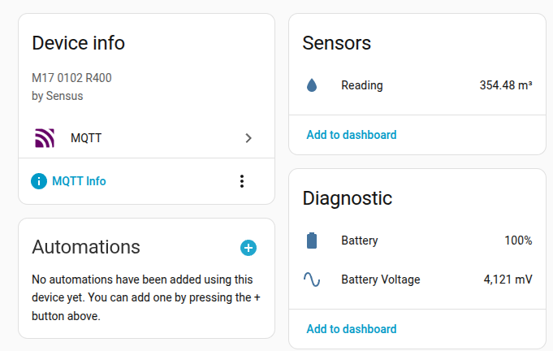

# esp32-meter-reader

Reads water meter digits using an ESP32 camera and PaddleOCR. Battery powered, no cables.

## How It Works

The ESP32 wakes from deep sleep on a timer, takes a photo of the meter, and POSTs the JPEG to your self-hosted OCR service.

The service extracts the reading and publishes it to Home Assistant via MQTT discovery, with Prometheus metrics for monitoring.

## Example

  <p align="center">
     
    
  </p>

## Table of Contents

- [Hardware](#hardware)
- [OCR Service](#ocr-service)
  - [Docker](#docker)
  - [Kubernetes](#kubernetes)
- [ESP32 Installation](#esp32-installation)
  - [Prerequisites](#prerequisites)
  - [Configuration](#configuration)
  - [Upload](#upload)
- [Configuration](#configuration-1)
  - [MQTT / Home Assistant](#mqtt--home-assistant)
  - [Storage](#storage)
- [API](#api)
- [Local Development](#local-development)
- [Compared to Other Projects](#compared-to-other-projects)

## Hardware

| Component | Description |
|---|---------------------------------------------------------------------------------------------------|
| [M5Stack Timer Camera X](https://docs.m5stack.com/en/unit/timercam_x) | ESP32-based controller with built-in battery, RTC, and deep sleep support. Has a 3MP OV3660 camera. |
| [M5Stack Unit FlashLight](https://docs.m5stack.com/en/unit/FlashLight) | LED flash unit. Connected via the GROVE port. Required for meters installed in dark enclosures. |

## OCR Service

The service listens on port **8080** by default. Note the hostname or IP address where you deploy it — you'll need it when configuring the Arduino sketch.

### Docker

```bash
docker run -d -p 8080:8080 ghcr.io/dcelasun/esp32-meter-reader:latest
```

With MQTT and storage:

```bash
docker run -d -p 8080:8080 \
  -v meter-data:/data \
  -e STORAGE_PATH=/data \
  -e MQTT_BROKER=tcp://192.168.1.100:1883 \
  -e MQTT_USER=homeassistant \
  -e MQTT_PASSWORD=secret \
  -e METER_DIVISOR=1000 \
  ghcr.io/dcelasun/esp32-meter-reader:latest
```

### Kubernetes

Copy and customize the example manifest:

```bash
cp k8s/manifest.example.yaml k8s/manifest.yaml
# Edit the Secret, env vars, and resource limits to match your cluster
kubectl apply -f k8s/manifest.yaml
```

The manifest includes a Secret for MQTT credentials, a PVC for image storage, a Deployment, a Service, and a ServiceMonitor for Prometheus metrics. See [`k8s/manifest.example.yaml`](k8s/manifest.example.yaml) for all available environment variables.

## ESP32 Installation

The ESP32 runs an Arduino sketch that handles the wake → capture → upload → sleep cycle.

### Prerequisites

- [Arduino IDE](https://www.arduino.cc/en/software) or PlatformIO
- [M5Stack Board Manager](https://docs.m5stack.com/en/arduino/arduino_ide) v2.0.9+
- Libraries:
  - [TimerCam-arduino](https://github.com/m5stack/TimerCam-arduino)
  - [ArduinoHttpClient](https://github.com/arduino-libraries/ArduinoHttpClient)

### Configuration

Open [`esp32/m5stack_timer_camera_x.ino`](esp32/m5stack_timer_camera_x.ino) and edit the defines at the top of the file. Set `_SERVER_HOST` and `_SERVER_PORT` to the hostname/IP and port of the OCR service you deployed above.

```cpp
#define _WIFI_SSID "My SSID"        // Your WiFi network name
#define _WIFI_PASS "MyPassword"      // Your WiFi password

#define _SERVER_HOST "192.168.1.50"  // IP or hostname of the OCR service
#define _SERVER_PORT 8080            // Port of the OCR service (default: 8080)

#define SLEEP_INTERVAL_SECS 14400    // Seconds between readings (14400 = 4 hours)
```

The FlashLight brightness is set to mode `1` (100% brightness, 220ms duration) in `sendImage()`. See the brightness table in the sketch for other modes. If your meter is well-lit, you can set it to `0` to disable the flash entirely.

### Upload

1. Connect the Timer Camera X via USB.
2. Select board **M5Stack-Timer-CAM** in the Arduino IDE.
3. Upload the sketch.

The device will immediately take a photo, POST it to the configured server, and enter deep sleep. The onboard LED will briefly flash on each wake cycle to confirm the device is alive.

## Configuration

All options can be set via CLI flags or environment variables. Flags take precedence.

| Flag | Env Var | Default | Description |
|------|---------|---------|-------------|
| `--listen-addr` | `LISTEN_ADDR` | `:8080` | Address and port for the HTTP server |
| `--ocr-script` | `OCR_SCRIPT` | `ocr.py` | Path to the PaddleOCR Python script |
| `--python-bin` | `PYTHON_BIN` | `/usr/bin/python3` | Path to the Python binary |
| `--storage-path` | `STORAGE_PATH` | *(disabled)* | Directory to store images and `readings.csv` |
| `--crop` | `CROP` | *(disabled)* | Crop rectangle as `x0,y0,x1,y1` applied before OCR |
| `--mqtt-broker` | `MQTT_BROKER` | *(disabled)* | MQTT broker URL, e.g. `tcp://192.168.1.100:1883` |
| `--mqtt-user` | `MQTT_USER` | | MQTT username |
| `--mqtt-password` | `MQTT_PASSWORD` | | MQTT password |
| `--mqtt-topic-prefix` | `MQTT_TOPIC_PREFIX` | `meter-reader` | Prefix for MQTT topics |
| `--mqtt-device-id` | `MQTT_DEVICE_ID` | `water_meter` | Device identifier for MQTT and HA discovery |
| `--mqtt-device-manufacturer` | `MQTT_DEVICE_MANUFACTURER` | `Generic` | Manufacturer shown in Home Assistant |
| `--mqtt-device-model` | `MQTT_DEVICE_MODEL` | `Generic` | Model shown in Home Assistant |
| `--meter-divisor` | `METER_DIVISOR` | `1000` | Divisor to convert raw reading to m³ (e.g. `000354225` / `1000` = `354.225`) |

### MQTT / Home Assistant

When `--mqtt-broker` is set, the service publishes [MQTT discovery](https://www.home-assistant.io/integrations/mqtt/#mqtt-discovery) configs on connect. Three sensors are created under a single device:

| Sensor | Device Class | Unit | State Class |
|--------|-------------|------|-------------|
| Water Meter Reading | `water` | m³ | `total_increasing` |
| Water Meter Battery | `battery` | % | `measurement` |
| Water Meter Battery Voltage | `voltage` | mV | `measurement` |

### Storage

When `--storage-path` is set, each successful reading stores:

- Original image as `YYYY/mm/dd/HH-MM-SS.jpg`
- Cropped image as `YYYY/mm/dd/HH-MM-SS_cropped.jpg` (if `--crop` is set)
- A row in `readings.csv`: `image_path,reading,timestamp`

## API

| Endpoint | Method | Description |
|----------|--------|-------------|
| `/ocr?bat_level=85&bat_voltage=4200` | `POST` | Submit a JPEG/PNG image as the request body. Returns JSON with OCR results. |
| `/health` | `GET` | Returns `200 OK`. |
| `/metrics` | `GET` | Prometheus metrics. |

**POST /ocr response:**

```json
{
  "raw_texts": ["SEnSUS", "CEM170102", "000354225", "640"],
  "scores": [0.82, 0.97, 0.99, 0.98],
  "reading": "000354225"
}
```

**Prometheus metrics:**

| Metric | Type | Description |
|--------|------|-------------|
| `meter_reading` | gauge | Last detected meter reading (raw integer) |
| `meter_battery_level_percent` | gauge | ESP32 battery level (0–100) |
| `meter_battery_voltage_millivolts` | gauge | ESP32 battery voltage in mV |
| `meter_ocr_duration_seconds` | histogram | OCR processing time |
| `meter_ocr_errors_total` | counter | Total OCR errors |

## Local Development

### Build

```bash
docker build -t esp32-meter-reader .
```

### Run

```bash
docker run -d -p 8080:8080 esp32-meter-reader
```

### Test

```bash
curl -X POST "http://localhost:8080/ocr?bat_level=85&bat_voltage=4200" \
  -H "Content-Type: image/jpeg" \
  --data-binary @meter-photo.jpg
```

### Build from source

```bash
go build -o esp32-meter-reader .

# Requires Python 3.13+ with paddlepaddle==3.2.2 and paddleocr installed
./esp32-meter-reader --ocr-script ocr.py --python-bin /path/to/venv/bin/python3
```

## Compared to Other Projects

esp32-meter-reader was inspired by [AI-on-the-edge-device](https://github.com/jomjol/AI-on-the-edge-device).

That's a great project, but it didn't fit my use case very well. Specifically:

- It needs an SD card to work. I wanted to use my existing M5Stack Timer Camera X, which does not have an SD card slot.
- Its pre-trained model is optimized for meters with mechanical digits. My meter has a digital display.
- Similarly, its model expects a clear image from a close distance. My meter is installed in a dark cabinet, and I could only place the camera at a distance.
- I wanted to use a battery-powered solution, without needing to plug in a cable, which was infeasible for my cabinet.

Given these constraints, any character recognition would have to happen off device. So I wrote my own service that runs on Docker or Kubernetes.
This way, the camera only briefly wakes up to take a photo, send it to the OCR service, and then goes back to sleep. This ensures that the battery lasts a long time, even with the flash attached.